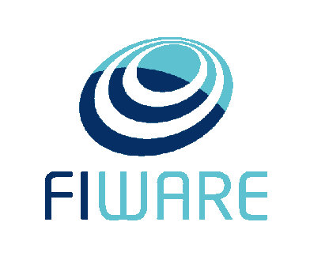
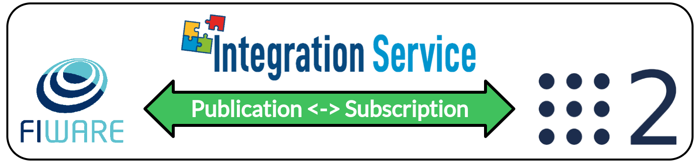

<a href="https://integration-service.docs.eprosima.com/"></a>

# FIWARE System Handle

[](https://github.com/eProsima/FIWARE-SH/actions)

## Introduction

### What is a System Handle?

A [System Handle](https://integration-service.docs.eprosima.com/en/latest/user_manual/systemhandle/sh.html) is a plugin that allows a certain middleware
or communication protocol to speak the same language used by the [eProsima Integration Service](https://github.com/eProsima/Integration-Service),
that is, *Extensible and Dynamic Topic Types for DDS* (**xTypes**);
specifically, *Integration Service* bases its intercommunication abilities on eProsima's open source
implementation for the *xTypes* protocol, that is, [eProsima xTypes](https://github.com/eProsima/xtypes).

<p align="center">
  <a href="https://integration-service.docs.eprosima.com/en/latest/user_manual/systemhandle/sh.html"></a>
</p>

### The FIWARE SystemHandle

<a href="https://www.fiware.org/"></a>

This repository contains the source code of *Integration Service* **System Handle**
for the [FIWARE](https://www.fiware.org/) middleware protocol, widely used in the robotics field.

The main purpose of the *FIWARE System Handle* is that of establishing a connection between a *FIWARE's Context Broker*
and an application running over a different middleware implementation.
This is the classic use-case approach for *Integration Service*.

## Dependencies

This section provides a list of the dependencies needed in order to compile *FIWARE System Handle*.

* [Asio](https://think-async.com/Asio/): C++ library for network and low-level I/O programming.
* [cURLpp](http://www.curlpp.org/): C++ wrapper for libcURL.
* [cURL](https://curl.se/): Command-line tool for getting or sending data using URL syntax.

These libraries can be installed using your Linux distribution package manager with the following command:

```
sudo apt-get install -y libcurlpp-dev libasio-dev libcurl4-openssl-dev
```

## Configuration

*Integration Service* is configured by means of a YAML configuration file, which specifies
the middlewares, topics and/or services involved in the intercommunication process, as well as
their topic/service types and the data exchange flow. This configuration file is loaded during
runtime, so there is no need to recompile any package before switching to a whole new
intercommunication architecture.

To get a more precise idea on how these YAML files have to be filled and which fields they require
in order to succesfully configure and launch an *Integration Service* project, please refer to the
[dedicated configuration section](https://integration-service.docs.eprosima.com/en/latest/user_manual/yaml_config.html) of the official documentation.

Regarding the *FIWARE System Handle*, there are several specific parameters which must be configured
for the FIWARE middleware. These parameters are mandatory, and fall as suboptions of the main
five sections described in the *Configuration* chapter of *Integration Service* repository:

* `systems`: The system `type` must be `fiware`. In addition to the
  `type` and `types-from` fields, the *FIWARE System Handle* accepts some specific
  configuration fields:

  ```yaml
  systems:
    fiware:
      type: fiware
      host: localhost
      port: 1026
  ```

    * `port`: The specific port where the *FIWARE's Context Broker* will listen for incoming connections. This field is
      required.
    * `host`: The IP address of the *FIWARE's Context Broker`. This field is required.
## Examples

There are several *Integration Service* examples using the *FIWARE System Handle* available
in the project's [main source code repository]([https://](https://github.com/eProsima/Integration-Service/tree/main/examples)).

Some of these examples, where the *FIWARE System Handle* plays a different role in each of them, are introduced here.

<a href="https://integration-service.docs.eprosima.com/en/latest/examples/different_protocols/pubsub/fiware-ros2.html"></a>

### FIWARE - ROS 2 bridge  (publisher - subscriber)

In this example, *Integration Service* uses both this *FIWARE System Handle* and the *ROS 2 System Handle*
to transmit data coming from a ROS 2 publisher into the FIWARE's Context Broker, so that it can be
consumed by FIWARE entities entities named equally to the *Integration Service*'s topic name; and viceversa.

<p align="center">
  <a href="https://integration-service.docs.eprosima.com/en/latest/examples/different_protocols/pubsub/fiware-ros2.html"></a>
</p>

The configuration file used by *Integration Service* for this example can be found
[here](https://github.com/eProsima/Integration-Service/blob/main/examples/basic/ros2_fiware__helloworld.yaml).

For a detailed step by step guide on how to build and test this example, please refer to the
[dedicated section](https://integration-service.docs.eprosima.com/en/latest/examples/different_protocols/pubsub/fiware-ros2.html) in the official documentation.
## Compilation flags

Besides the [global compilation flags](https://integration-service.docs.eprosima.com/en/latest/installation_manual/installation.html#global-compilation-flags) available for the
whole *Integration Service* product suite, there are some specific flags which apply only to the
*FIWARE System Handle*; they are listed below:

* `BUILD_FIWARE_TESTS`: Allows to specifically compile the *FIWARE System Handle* unitary and
  integration tests; this is useful to avoid compiling each *System Handle's* test suite present
  in the `colcon` workspace, which is what would happen if using the `BUILD_TESTS` flag; and thus,
  minimizing the building time; to use it, after making sure that the *FIWARE System Handle*
  is present in the `colcon` workspace, the following command must be executed:
  ```bash
  ~/is_ws$ colcon build --cmake-args -DBUILD_FIWARE_TESTS=ON
  ```

## Documentation

The official documentation for the *FIWARE System Handle* is included within the official *Integration Service*
documentation, hosted by [Read the Docs](https://integration-service.docs.eprosima.com/), and comprises the following sections:

* [Installation Manual](https://integration-service.docs.eprosima.com/en/latest/installation_manual/installation_manual.html)
* [User Manual](https://integration-service.docs.eprosima.com/en/latest/user_manual/systemhandle/fiware_sh.html)

## License

This repository is open-sourced under the *Apache-2.0* license. See the [LICENSE](LICENSE) file for more details.

## Getting help

If you need support you can reach us by mail at `support@eProsima.com` or by phone at `+34 91 804 34 48`.


<!--
    ROSIN acknowledgement from the ROSIN press kit
    @ https://github.com/rosin-project/press_kit
-->

<a href="http://rosin-project.eu">
  
</a>

Supported by ROSIN - ROS-Industrial Quality-Assured Robot Software Components.
More information: <a href="http://rosin-project.eu">rosin-project.eu</a>


This project has received funding from the European Union’s Horizon 2020
research and innovation programme under grant agreement no. 732287.
