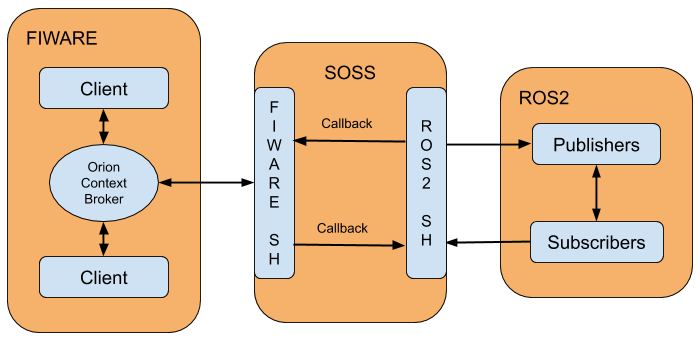

# *soss-fiware* system handle

## Example of fiware with ros2 connectivity

## Class diagram

## Sequence diagram

## Project layout:
- `Dockerfile`: Dockerfile with a system already configured with ROS2
- `doc` folder: contains the design and user documentation.
- `examples` folder: contains a *.yaml* file example and utils for running *soss-dds* easily.
- `packages`: colcon packages for this middleware
    - `fiware`: main system handler
        - `src` folder: contains the implementation of *soss-fiware* library.
    - `fiware-test`: system handler for testing the `fiware` system handler.
        - `src` folder: contains the test sources
        - `thirdparty` folder: contains the external code used and distributed with the project.
            - `catch2` folder: contains the *catch2* test framework
