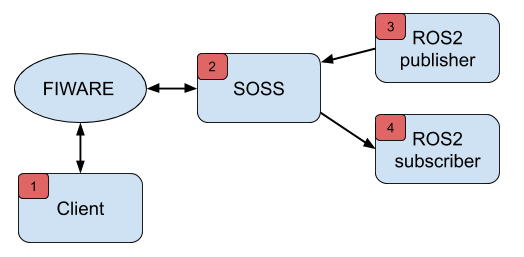

# Fiware system handle demo (April 2019)


## Demo steps
> **print** after the sentence means that the message must be printed in video post-production

### 0. All terminals open
1. [console 1] fiware client
```
#the fiware context broker is already open at `192.168.1.59:1026`.
```
2. [console 2] soss (with soss environment configured)
3. [console 3] ros publiher (with ros2 environment configured)
4. [console 4] ros subscriber (with ros2 environment configured)

### 1. Create fiware entities [Console 1]
1. Create entity `hello_ros2` in fiware with type `std_msgs__String`. **print**
```
curl 192.168.1.59:1026/v2/entities -s -S -H 'Content-Type: application/json' -d @- <<EOF
{
  "id": "hello_ros2",
  "type": "std_msgs__String",
  "data": {
    "value": "Hello, ros2",
    "type": "String"
  }
}
EOF
```
2. Create entity `hello_fiware` in fiware with type `std_msgs__String`. **print**
```
curl 192.168.1.59:1026/v2/entities -s -S -H 'Content-Type: application/json' -d @- <<EOF
{
  "id": "hello_fiware",
  "type": "std_msgs__String",
  "data": {
    "value": "",
    "type": "String"
  }
}
EOF
```
3. Show entities.
```
curl 192.168.1.59:1026/v2/entities -s -S -H 'Accept: application/json' | python -mjson.tool
```

### 2. Create Ros2 subscriber [Console 4]
1. Run a ros2 subscriber to topic `hello_ros2` with type `std_msgs/String`. **print**
```
ros2 topic echo /hello_ros2 std_msgs/String
```

### 3. Run SOSS [Console 2]
1. Show yaml file for configuration.
```
vi src/osrf/soss/cpp/fiware/sample/hello_fiware_ros2.yaml
```
2. Explain yaml file
    1. `host` and `port`: fiware server. **print**
    2. `subscription_host` and `subscription_port`:
The fiware system handle run an internal server for the subscriptions and it must be known by fiware. **print**
    3. The `routes` part indicates that both direction are allowed. **print**
    4. The `topics` part configures allows `hello_fiware` and `hello_ros2` topics
with type `std_msgs/String` for the communication. **print**
3. exit .yaml file: `:q`
4. Run soss **print**
```
soss src/osrf/soss/cpp/fiware/sample/hello_fiware_ros2.yaml
```
5. New topic arrives to ros2 because soss has subscribed to `hello_ros2` topic. **print**

### 4. Send topics from fiware to ros2 [Console 1]
1. Update the `hello_ros2` entity value. **print**
```
curl 192.168.1.59:1026/v2/entities/hello_ros2/attrs -s -S -H 'Content-Type: application/json' -X PUT -d @- <<EOF
{
  "data": {
    "value": "Hello, ros2 again",
    "type": "String"
  }
}
EOF
```
2. The updated topic information arrives to ros2 **print**

### 5. Send topics from ros2 to fiware [Console 1] [Console 3]
1. [Console1] Current topic value for `hello_fiware`. **print**
```
curl 192.168.1.59:1026/v2/entities/hello_fiware -s -S -H 'Accept: application/json' | python -mjson.tool
```
2. [Console 3] Run a ros2 publisher for sending `hello_fiware` topics with type `std_msgs/String`. **print**
```
ros2 topic pub --once /hello_fiware std_msgs/String "{data: \"Hello, fiware\"}"
```
1. [Console1] Current topic value for `hello_fiware` updated. **print**
```
curl 192.168.1.59:1026/v2/entities/hello_fiware -s -S -H 'Accept: application/json' | python -mjson.tool
```

---

## Annex: *curl* commands to manage *fiware*
The following are the *curl* commands most used to manage the *fiware context broker* from the console.
Modify the `ip:port` from the init of the *curl* command where the *fiware context broker* is running.

### POST
- Create entity
```
curl 192.168.1.59:1026/v2/entities -s -S -H 'Content-Type: application/json' -d @- <<EOF
{
  "id": "hello_ros2",
  "type": "std_msgs__String",
  "data": {
    "value": "Hello, ros2",
    "type": "String"
  }
}
EOF
```

- Create subscription
```
curl 192.168.1.59:1026/v2/subscriptions -s -S -H 'Content-Type: application/json' -d @- <<EOF
{
  "subject": {
    "entities": [
      {
        "id": "hello_ros2"
      }
    ]
  },
  "notification": {
    "http": {
      "url": "http://192.168.1.56:1028"
    }
  }
}
EOF
```

### PUT

- Update an entity
```
curl 192.168.1.59:1026/v2/entities/hello_ros2/attrs -s -S -H 'Content-Type: application/json' -X PUT -d @- <<EOF
{
  "data": {
    "value": "Hello, ros2",
    "type": "String"
  }
}
EOF
```

### GET

- Show entity
```
curl 192.168.1.59:1026/v2/entities/hello_ros2 -s -S -H 'Accept: application/json' | python -mjson.tool

```

- Show entity (specifying the type)
```
curl 192.168.1.59:1026/v2/entities/hello_ros2?type=std_msgsString -s -S -H 'Accept: application/json' | python -mjson.tool
```

- List all entities
```
curl 192.168.1.59:1026/v2/entities -s -S -H 'Accept: application/json' | python -mjson.tool
```

- List all subscriptions
```
curl 192.168.1.59:1026/v2/subscriptions -s -S -H 'Accept: application/json' | python -mjson.tool
```

### DELETE

- Remove entity

```
curl 192.168.1.59:1026/v2/entities/hello_ros2 -s -S -H 'Accept: application/json' -X DELETE | python -mjson.tool
```

- Remove entity (specifying the type)
```
curl 192.168.1.59:1026/v2/entities/hello_ros2?type=std_msgsString -s -S -H 'Accept: application/json' -X DELETE | python -mjson.tool
```

- Remove subscription
```
curl 192.168.1.59:1026/v2/subscriptions/5cc3f909efccc70b574a4611 -s -S -H 'Accept: application/json' -X DELETE
```

For removing all subscriptions, please, use the script found into utils `erase_subscriptions.sh`

